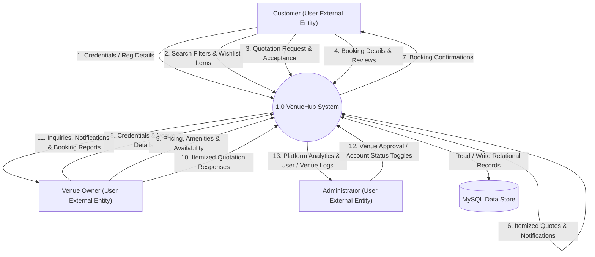
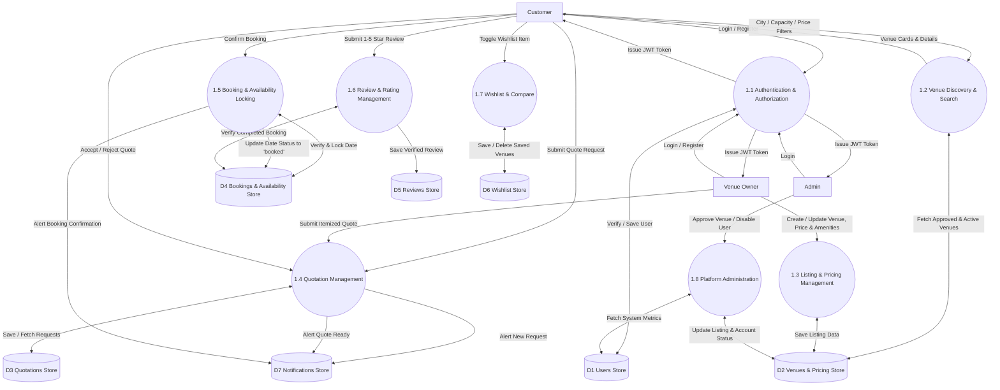

# VenueHub Data Flow Diagrams (DFD)

This document provides Level 0 (Context Level) and Level 1 (Functional Decomposition) Data Flow Diagrams for **VenueHub**.

---

## 1. Level 0 Data Flow Diagram (Context Level)

The Level 0 DFD illustrates the overall system boundaries of VenueHub, detailing the data exchanges between external entities (**Customer**, **Venue Owner**, **Admin**) and the central **VenueHub System**, backed by the **MySQL Data Store**.

---

## 2. Level 1 Data Flow Diagram (Functional Decomposition)

The Level 1 DFD decomposes the VenueHub System into 8 primary functional sub-processes:

