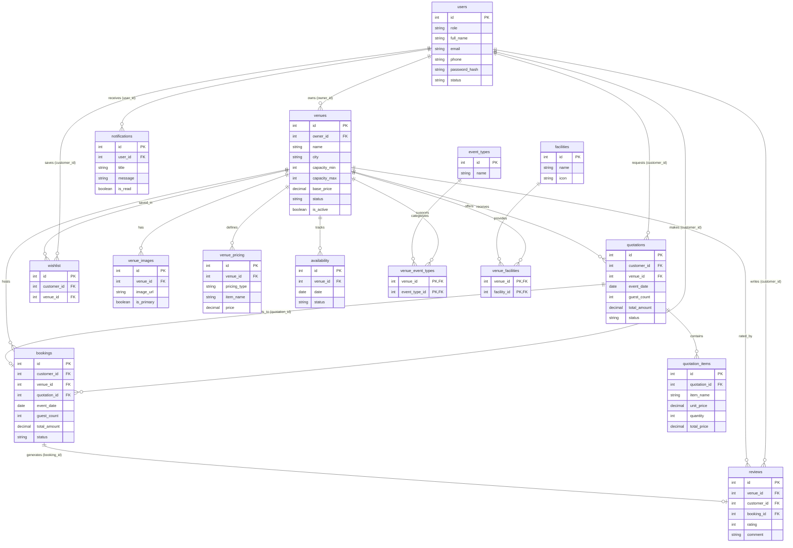

# VenueHub Database Entity-Relationship (ER) Documentation

This document provides a detailed description of the relational database design for **VenueHub**, covering the 15 MySQL tables defined in `database/schema.sql`.

---

## 1. Table Definitions & Primary Keys

| Table Name | Primary Key | Description |
| :--- | :--- | :--- |
| `users` | `id` (AUTO_INCREMENT) | Stores user accounts for Customers, Venue Owners, and Admins. |
| `venues` | `id` (AUTO_INCREMENT) | Stores event venue property listings created by Venue Owners. |
| `venue_images` | `id` (AUTO_INCREMENT) | Photo gallery for venue property listings. |
| `event_types` | `id` (AUTO_INCREMENT) | Master list of event categories (Wedding, Birthday, Corporate, etc.). |
| `venue_event_types` | (`venue_id`, `event_type_id`) | Junction table mapping many-to-many relationship between Venues and Event Types. |
| `facilities` | `id` (AUTO_INCREMENT) | Master list of venue amenities (AC, Parking, Catering, DJ, etc.). |
| `venue_facilities` | (`venue_id`, `facility_id`) | Junction table mapping many-to-many relationship between Venues and Facilities. |
| `venue_pricing` | `id` (AUTO_INCREMENT) | Detailed pricing rules and fee components defined per venue. |
| `availability` | `id` (AUTO_INCREMENT) | Calendar date availability and blockage tracking per venue. |
| `quotations` | `id` (AUTO_INCREMENT) | Custom pricing requests submitted by Customers and answered by Owners. |
| `quotation_items` | `id` (AUTO_INCREMENT) | Line-item cost breakdown inside a quotation response. |
| `bookings` | `id` (AUTO_INCREMENT) | Finalized event reservations created upon quotation acceptance. |
| `reviews` | `id` (AUTO_INCREMENT) | Post-event customer reviews and ratings (1–5 stars). |
| `wishlist` | `id` (AUTO_INCREMENT) | Customer favorite venue bookmarks (unique per customer & venue). |
| `notifications` | `id` (AUTO_INCREMENT) | System alerts and user notifications. |

---

## 2. Relational Cardinalities & Foreign Keys

1. **`users` $\rightarrow$ `venues` (1 : N)**
   * Foreign Key: `venues.owner_id` $\rightarrow$ `users.id` (`ON DELETE CASCADE`)
   * Description: One Venue Owner user can list and manage multiple venues.

2. **`venues` $\rightarrow$ `venue_images` (1 : N)**
   * Foreign Key: `venue_images.venue_id` $\rightarrow$ `venues.id` (`ON DELETE CASCADE`)
   * Description: A single venue has multiple gallery images.

3. **`venues` $\leftrightarrow$ `event_types` (N : M)**
   * Junction Table: `venue_event_types`
   * Foreign Keys: `venue_id` $\rightarrow$ `venues.id`, `event_type_id` $\rightarrow$ `event_types.id`
   * Description: A venue supports multiple event types, and an event type can apply to multiple venues.

4. **`venues` $\leftrightarrow$ `facilities` (N : M)**
   * Junction Table: `venue_facilities`
   * Foreign Keys: `venue_id` $\rightarrow$ `venues.id`, `facility_id` $\rightarrow$ `facilities.id`
   * Description: A venue offers multiple facilities/amenities, and a facility can be offered by multiple venues.

5. **`venues` $\rightarrow$ `venue_pricing` (1 : N)**
   * Foreign Key: `venue_pricing.venue_id` $\rightarrow$ `venues.id` (`ON DELETE CASCADE`)
   * Description: A venue defines multiple pricing components (Hall Rental, Catering, Decor, Audio/Visual).

6. **`venues` $\rightarrow$ `availability` (1 : N)**
   * Foreign Key: `availability.venue_id` $\rightarrow$ `venues.id` (`ON DELETE CASCADE`)
   * Description: Tracks availability status (`available`, `booked`, `blocked`) for individual calendar dates.

7. **`users` & `venues` $\rightarrow$ `quotations` (1 : N & 1 : N)**
   * Foreign Keys: `quotations.customer_id` $\rightarrow$ `users.id`, `quotations.venue_id` $\rightarrow$ `venues.id`
   * Description: Customers submit quotation requests to specific venues.

8. **`quotations` $\rightarrow$ `quotation_items` (1 : N)**
   * Foreign Key: `quotation_items.quotation_id` $\rightarrow$ `quotations.id` (`ON DELETE CASCADE`)
   * Description: An owner's quotation proposal contains an itemized breakdown of prices.

9. **`quotations` $\rightarrow$ `bookings` (1 : 1 Optional)**
   * Foreign Key: `bookings.quotation_id` $\rightarrow$ `quotations.id` (`ON DELETE SET NULL`)
   * Description: Accepting a quotation converts it into a confirmed booking.

10. **`users` & `venues` $\rightarrow$ `bookings` (1 : N & 1 : N)**
    * Foreign Keys: `bookings.customer_id` $\rightarrow$ `users.id`, `bookings.venue_id` $\rightarrow$ `venues.id`
    * Description: Connects customer and venue to finalized event reservations.

11. **`bookings` $\rightarrow$ `reviews` (1 : 1 Optional)**
    * Foreign Key: `reviews.booking_id` $\rightarrow$ `bookings.id` (`ON DELETE SET NULL`)
    * Description: Reviews are strictly tied to completed bookings to ensure authenticity.

12. **`users` & `venues` $\rightarrow$ `wishlist` (N : M)**
    * Foreign Keys: `wishlist.customer_id` $\rightarrow$ `users.id`, `wishlist.venue_id` $\rightarrow$ `venues.id`
    * Description: Unique pair constraint `uk_customer_venue` prevents duplicate wishlist entries.

13. **`users` $\rightarrow$ `notifications` (1 : N)**
    * Foreign Key: `notifications.user_id` $\rightarrow$ `users.id` (`ON DELETE CASCADE`)
    * Description: Stores automated system activity alerts for users.

---

## 3. Mermaid ER Diagram

