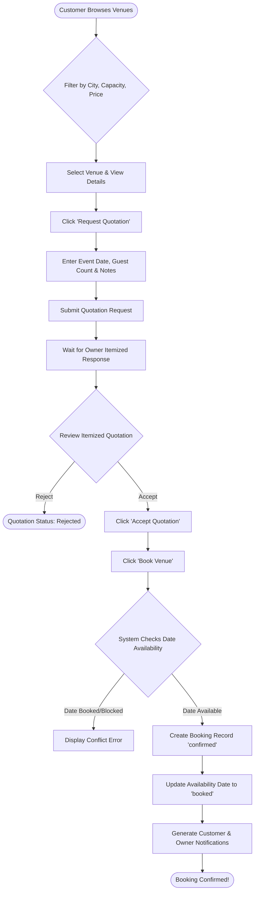
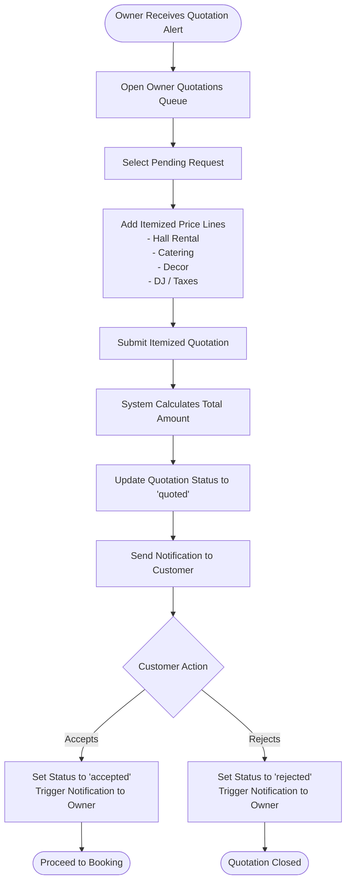
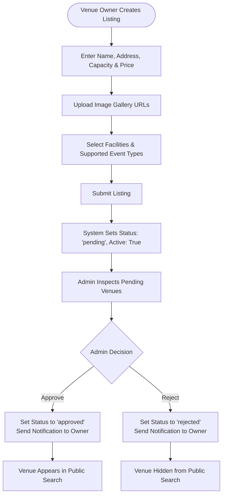
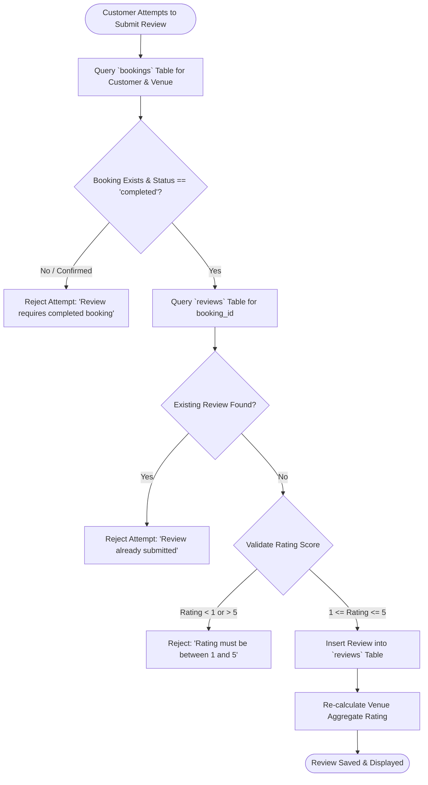
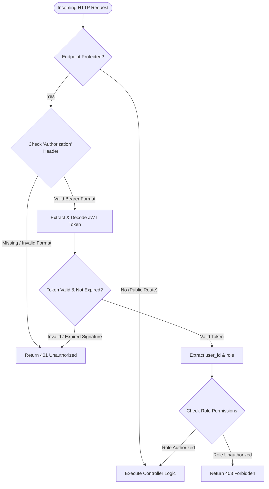

# VenueHub Key System Flowcharts

This document provides visual flowcharts using Mermaid syntax for 6 primary operational workflows within **VenueHub**.

---

## 1. Customer Booking Flow



---

## 2. Quotation Processing Flow



---

## 3. Venue Approval & Management Flow



---

## 4. Availability Checking & Protection Flow

```mermaid
flowchart TD
    A([Customer Selects Date for Booking]) --> B[Query `availability` Table for (venue_id, date)]
    B --> C{Record Exists?}
    C -- No Record --> D[Date Available by Default]
    C -- Record Found --> E{Check Status Column}
    E -- 'booked' --> F[Block Booking Attempt - Return Error]
    E -- 'blocked' --> F
    E -- 'available' --> D
    D --> G[Create Booking Record]
    G --> H[Insert/Update `availability` SET status = 'booked']
    H --> I([Date Locked Successfully])
```

---

## 5. Review Submission Flow



---

## 6. Authentication & Role Authorization Flow


