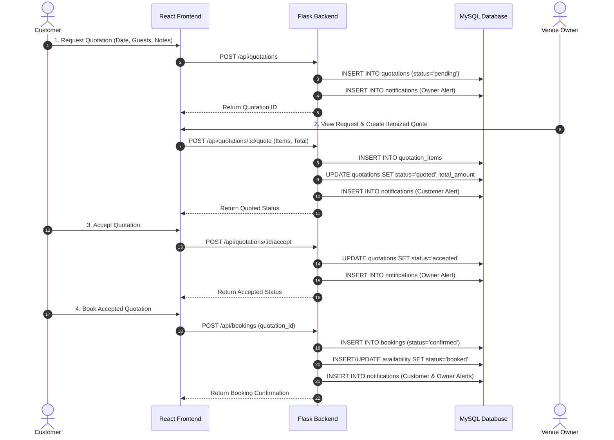

# VenueHub System Architecture Specification

This document details the decoupled 3-tier system architecture of **VenueHub**, explaining client-server interaction patterns, security token handling, database connectivity, and data transaction lifecycle.

---

## 1. High-Level Architectural Layers

VenueHub utilizes a modern client-server decoupled web architecture split across three distinct computing tiers:

```
+-------------------------------------------------------------------+
|                        PRESENTATION TIER                          |
|                       Client Browser (React)                      |
|  - React 19 SPA with Client Routing (React Router v7)            |
|  - State Management & Local Storage (Venue Comparison)           |
|  - Axios HTTP REST Client with Bearer Token Headers               |
+---------------------------------+---------------------------------+
                                  |
               JSON HTTP/REST Requests (Port 5000)
                                  |
+---------------------------------v---------------------------------+
|                        APPLICATION TIER                           |
|                       Backend Server (Flask)                      |
|  - Flask 3.1 WSGI App with Modular Blueprints                      |
|  - Auth Middleware: JWT Verification & bcrypt Password Hashing   |
|  - Role-Based Access Control (RBAC) Protection                    |
|  - Business Logic & Payload Validation                            |
+---------------------------------+---------------------------------+
                                  |
              PyMySQL Database Connection (Port 3306)
                                  |
+---------------------------------v---------------------------------+
|                            DATA TIER                              |
|                    Database Engine (MySQL 8.0)                    |
|  - Relational Schema with 15 InnoDB Tables                        |
|  - Primary Keys, Foreign Keys (Cascade/Set Null), Indexes         |
+-------------------------------------------------------------------+
```

---

## 2. Component Explanations

### 2.1 Presentation Tier (React Frontend)
* **Framework & Build:** Built using **React (v19)** and bundled with **Vite (v8)** for high-performance development and production asset optimization.
* **Routing:** **React Router DOM (v7)** manages single-page application (SPA) client-side routing without page reloads.
* **HTTP Communication:** **Axios (v1.20)** handles asynchronous REST API calls to the Flask backend, injecting the `Authorization: Bearer <token>` header into protected requests.
* **Client State & Storage:** React state (`useState`, `useEffect`) manages dynamic UI states. `localStorage` is used for authentication tokens (`venuehub_token`), user profile metadata (`venuehub_user`), and comparing selected venues (`venuehub_compare`).

### 2.2 Application Tier (Flask Backend)
* **Framework:** Powered by **Flask (v3.1)** in Python (v3.12). Organized modularly using Flask **Blueprints** (`auth_bp`, `venues_bp`, `quotations_bp`, `bookings_bp`, `reviews_bp`, `admin_bp`, etc.).
* **Authentication:** **PyJWT (v2.13)** generates and decodes JSON Web Tokens. Passwords are secured using **bcrypt (v5.0)** with salt rounds.
* **Authorization Middleware:** `verify_request_token(request)` parses incoming HTTP headers, validates JWT signatures using a secret key, checks expiration timestamps (`exp`), and exposes `user_id` and `role`.
* **CORS Handling:** **Flask-CORS (v6.0)** enables Cross-Origin Resource Sharing for communication between the React frontend and Flask API backend.

### 2.3 Data Tier (MySQL Database)
* **Database Management System:** **MySQL (v8.0+)** operating with the **InnoDB** storage engine.
* **Driver:** **PyMySQL (v1.2)** provides native Python database connection handling and parameterized query execution (`%s`) to prevent SQL injection.
* **Data Integrity:** Enforces relational foreign key constraints with `ON DELETE CASCADE` or `ON DELETE SET NULL` rules, unique index constraints, and transaction control (`connection.commit()`, `connection.rollback()`).

---

## 3. Data Processing & Transaction Lifecycle

### 3.1 Authentication & Request Flow
1. User enters credentials in the React `Login` component.
2. Axios posts credentials to `POST /api/auth/login`.
3. Flask backend queries `users` table, verifies password with `bcrypt.checkpw()`, and generates a signed JWT token.
4. React frontend saves JWT token and user info to `localStorage` and redirects to the appropriate dashboard (`CustomerDashboard`, `OwnerDashboard`, `AdminDashboard`).

### 3.2 Quotation to Booking & Availability Locking Lifecycle


---

## 4. Security Architecture

1. **Token Verification:** Every protected endpoint calls `verify_request_token(request)` prior to executing controller logic.
2. **Role Verification:** Requests are checked against role rules:
   * Admin Endpoints (`/api/admin/*`): Requires `role == 'admin'`.
   * Owner Endpoints (`/api/owner/*`, `/api/venues/<id>/quotations`): Requires `role == 'venue_owner'` or `role == 'admin'`.
   * Customer Endpoints (`/api/quotations`, `/api/bookings`, `/api/wishlist`): Requires `role == 'customer'`.
3. **Data Isolation:** Backend queries automatically inject ownership filters (`WHERE owner_id = user_id`, `WHERE customer_id = user_id`) to ensure users can only view and modify their authorized resource records.
